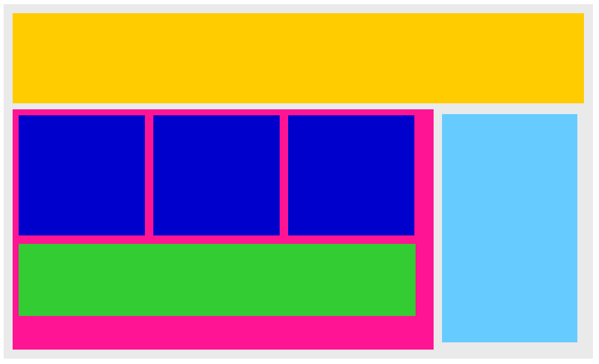

# Posición de Práctica

Este proyecto muestra una página web diseñada para practicar la disposición de elementos utilizando HTML y CSS. La página incluye una navegación superior, contenido principal con sub-secciones y una barra lateral.

## Vista del Modelo

Aquí puedes ver la imagen del modelo que se utilizó como referencia:

## Vista Codificada

A continuación, se muestra la imagen del resultado codificado:

## Estructura del Proyecto

El proyecto se compone de las siguientes secciones:

- **Header**: Navegación superior vacía que puede ser estilizada con CSS.
- **Main**: Contiene el contenido principal dividido en tres sub-secciones y una sección para publicidad.
  - **Sub-secciones**: Tres divisiones para contenido adicional.
  - **Publicidad**: Un div identificado como `advertisement`.
- **Side Navigation**: Una barra lateral vacía para navegación adicional.

## Tecnologías Utilizadas
- HTML5: Para la estructura del contenido.
- CSS3: Para el diseño y estilos de la página.